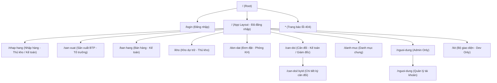

# Tài liệu Đặc tả Kiến trúc: Hệ thống Điều hướng (Routing) & Quy ước Đặt tên (Naming Convention)

- **Tác giả:** AI Architect (Antigravity)
- **Ngày lập:** 2026-08-07
- **Trạng thái:** DỰ THẢO (Chờ phê duyệt)
- **Tài liệu liên quan:** 
  - [`CLAUDE.md`](file:///c:/Users/ACER/baseafood-mes/CLAUDE.md)
  - [`docs/app-map/02-pages-navigation.md`](file:///c:/Users/ACER/baseafood-mes/docs/app-map/02-pages-navigation.md)
  - [`docs/app-map/03-database.md`](file:///c:/Users/ACER/baseafood-mes/docs/app-map/03-database.md)
  - [`docs/app-map/04-tang-du-lieu.md`](file:///c:/Users/ACER/baseafood-mes/docs/app-map/04-tang-du-lieu.md)

---

## PHẦN A — KIẾN TRÚC ROUTING / PHÂN TRANG

### 1. Hiện trạng & Hạn chế của Cơ chế cũ (State-based Navigation)
Hiện tại, ứng dụng điều hướng hoàn toàn bằng cách thay đổi giá trị của state `screen` trong component `App.tsx` (dòng 107) và render có điều kiện các component tương ứng (dòng 253-264). 

**Các hạn chế cốt lõi khi hệ thống phình to:**
* **Mất trạng thái khi tải lại trang (Refresh / F5):** Trình duyệt không lưu đường dẫn URL. Khi người dùng nhấn F5 hoặc tải lại tab, ứng dụng tự động reset về màn hình mặc định là `nhap-hang`. Điều này gây ức chế lớn cho người sử dụng tại xưởng khi mạng chập chờn.
* **Không thể chia sẻ liên kết trực tiếp (Deep Linking):** Người dùng (ví dụ: Kế toán hoặc Quản đốc) không thể sao chép URL để gửi trực tiếp cho đồng nghiệp xem một ngày nhập hàng cụ thể hoặc một kỳ cân đối xác định (ví dụ: `can-doi/ky-2026-08`).
* **Trình duyệt không hỗ trợ các nút Back/Forward:** Lịch sử duyệt của trình duyệt bị vô hiệu hóa hoàn toàn, người dùng không thể bấm nút Quay lại của thiết bị Android/iOS/Tablet để về màn hình trước đó.
* **Phình to Bundle Size ban đầu:** Tất cả các màn hình lớn (`NhapNguyenLieu`, `BanHang`, `CanDoi`, `DanhMuc`, `QuanLyNguoiDung`) đều được import trực tiếp vào `App.tsx` (dòng 2-10). Khi ứng dụng có thêm nhiều tính năng mới (như WIP sản xuất, Đơn đặt, Kho lạnh dự trữ), kích thước bundle ban đầu sẽ tăng mạnh, làm chậm tốc độ tải trang lần đầu tiên trên thiết bị di động/tablet có cấu hình thấp của thủ kho.

---

### 2. So sánh giải pháp & Khuyến nghị Router

Chúng ta so sánh 3 phương án khả thi dựa trên các tiêu chí tương thích với **React 19** và **Vite 8** hiện tại của dự án:

| Tiêu chí | react-router-dom (v7) | TanStack Router | Tự viết Minimal Router |
|---|---|---|---|
| **React 19 / Vite 8** | Tương thích hoàn toàn (hỗ trợ native React 19). | Tương thích tốt, nhưng cần setup plugin đi kèm. | Hoàn toàn kiểm soát được vì tự code bằng vanila JS hooks. |
| **Kích thước Bundle** | ~15-20 KB (gzipped). Khá nhẹ, không ảnh hưởng tới MES. | ~10 KB (gzipped). Rất tối ưu. | < 1 KB. |
| **Học tập & Độ quen thuộc** | **Cực kỳ quen thuộc** với hầu hết lập trình viên React. | Trung bình - Mới (mô hình type-safe router). | Đơn giản nhưng đòi hỏi phải tự viết và tự bảo trì. |
| **Lazy-loading & Code splitting** | Hỗ trợ tuyệt vời thông qua `lazy()` hoặc route configuration. | Rất mạnh mẽ, tạo file-based splitting tự động. | Phải tự kết hợp với `React.lazy()` và `Suspense` thủ công. |
| **Auth Gate (Role check)** | Rất dễ cấu hình thông qua layout routes hoặc Route Wrappers. | Hỗ trợ qua callback `beforeLoad`. | Phải tự xử lý logic kiểm tra trong switcher. |
| **Độ phức tạp / Rủi ro** | **Thấp nhất**. Thư viện chuẩn mực, tài liệu phong phú, ổn định cao. | Cao. Yêu cầu cài đặt Vite plugin (`@tanstack/router-plugin`) để gen code. Có thể lỗi CLI trên Windows. | Trung bình. Phải tự xử lý các trường hợp edge cases (params, query, popstate). |

> [!TIP]
> **KHUYẾN NGHỊ CHỌN:** **`react-router-dom` (phiên bản v7)**. 
> 
> *Lý do:* Đây là giải pháp an toàn và chuẩn mực nhất. Phiên bản v7 của React Router thừa hưởng tính năng ổn định từ Remix, hỗ trợ React 19 tối đa, cấu hình Route đơn giản bằng code (không bắt buộc dùng file-system routing phức tạp), dễ dàng tích hợp Route Guards và tính năng lazy load, tránh rủi ro lỗi CLI phát sinh trên môi trường Windows mà dự án đang bị giới hạn (như lỗi CLI shadcn đã nêu tại rule #10 trong `CLAUDE.md`).
> 
> *Lưu ý về môi trường mạng tại xưởng:* Để phòng tránh lỗi cấu hình Web Server (khi server không định tuyến tất cả request về `index.html`), chúng ta nên triển khai dưới dạng **`HashRouter`** thay vì `BrowserRouter`. Điều này giúp ứng dụng chạy offline hoàn toàn từ local file hoặc các server không có SPA fallback cấu hình sẵn mà vẫn giữ nguyên route trên URL (sử dụng `#`).

---

### 3. Đề xuất Sơ đồ Route & Cấu trúc Thư mục mới

#### A. Sơ đồ Route (Route Schema)

Hệ thống điều hướng sẽ được bọc trong một Auth Layout để kiểm tra phiên đăng nhập và phân quyền.



*Chi tiết các Route:*
1. **`/login`**: Trang đăng nhập (`DangNhap.tsx`). Không yêu cầu phiên đăng nhập. Nếu đã đăng nhập, tự động redirect về trang chủ (`/nhap-hang`).
2. **`/nhap-hang`**: Trang nhập nguyên liệu (`NhapNguyenLieu.tsx`). Vai trò: Mọi vai trò.
3. **`/san-xuat`**: Trang sản xuất bán thành phẩm (`SanXuatBTP.tsx`). Vai trò: Mọi vai trò.
4. **`/ban-hang`**: Trang bán hàng (`BanHang.tsx`). Vai trò: Mọi vai trò.
5. **`/kho`**: Trang kho dự trữ (`KhoDuTru.tsx`). Vai trò: Mọi vai trò.
6. **`/don-dat`**: Trang quản lý đơn đặt (`DonDat.tsx`). Vai trò: Mọi vai trò.
7. **`/can-doi`**: Trang quản lý kỳ cân đối (`CanDoi.tsx`). Vai trò: Kế toán, Giám đốc, Admin.
8. **`/can-doi/:kyId`**: Trang chi tiết một kỳ cân đối cụ thể. *Đặc biệt hữu ích để liên kết sâu dữ liệu.*
9. **`/danh-muc`**: Quản lý danh mục chung (`DanhMuc.tsx`). Vai trò: Mọi vai trò.
10. **`/nguoi-dung`**: Quản lý tài khoản và phân quyền. Vai trò: Chỉ `admin` được phép vào. Nếu cố tình truy cập sẽ redirect về `/403` hoặc `/nhap-hang`.
11. **`/kit`**: Trang Kit duyệt UI. Vai trò: Chỉ dev/admin truy cập được từ nút cuối thanh bên (chỉ hiện trên màn hình desktop).
12. **`*` (404 Page)**: Hiển thị giao diện báo lỗi đường dẫn không hợp lệ kèm nút quay về trang chủ.

#### B. Cấu trúc Thư mục features/ Đề xuất
Để hỗ trợ việc lazy-load và chuẩn hóa theo quy tắc "1-trang-1-route", cấu trúc thư mục `src/features/` sẽ được tổ chức lại từ dạng file phẳng sang dạng module:

```
src/features/
├── auth/
│   ├── index.ts
│   └── DangNhap.tsx
├── nhap-hang/
│   ├── index.ts
│   └── NhapNguyenLieu.tsx
├── san-xuat/
│   ├── index.ts
│   └── SanXuatBTP.tsx
├── ban-hang/
│   ├── index.ts
│   └── BanHang.tsx
├── kho/
│   ├── index.ts
│   └── KhoDuTru.tsx
├── don-dat/
│   ├── index.ts
│   └── DonDat.tsx
├── can-doi/
│   ├── index.ts
│   ├── CanDoi.tsx
│   ├── BangCanDoi.tsx
│   └── components/
│       └── KyDetail.tsx
├── danh-muc/
│   ├── index.ts
│   ├── DanhMuc.tsx
│   └── ThanhPham.tsx
├── nguoi-dung/
│   ├── index.ts
│   └── QuanLyNguoiDung.tsx
└── shared/                          # Chứa các component dùng chung cho features
    └── NotFound.tsx
```
*Lưu ý:* File `index.ts` trong mỗi thư mục feature sẽ export default component chính để phục vụ lazy load dạng:
```typescript
// src/features/nhap-hang/index.ts
export { default } from "./NhapNguyenLieu";
```

#### C. Kỹ thuật Lazy Load trong Router
Chúng ta cấu hình lazy load bằng React Router v7 kết hợp `Suspense` để hiển thị màn hình chờ mượt mà:
```tsx
import { lazy, Suspense } from "react";
import { HashRouter, Routes, Route, Navigate } from "react-router-dom";

const NhapHang = lazy(() => import("@/features/nhap-hang"));
const CanDoi = lazy(() => import("@/features/can-doi"));
// ... tương tự cho các màn khác

export default function AppRouter() {
  return (
    <Suspense fallback={<div className="flex h-screen items-center justify-center text-lg">Đang tải...</div>}>
      <Routes>
        <Route path="/login" element={<DangNhap />} />
        
        {/* Protected Routes */}
        <Route element={<ProtectedRoute />}>
          <Route path="/" element={<Navigate to="/nhap-hang" replace />} />
          <Route path="/nhap-hang" element={<NhapHang />} />
          <Route path="/can-doi" element={<CanDoi />} />
          {/* Admin only route */}
          <Route element={<AdminRoute />}>
            <Route path="/nguoi-dung" element={<NguoiDung />} />
          </Route>
        </Route>
        
        <Route path="*" element={<NotFound />} />
      </Routes>
    </Suspense>
  );
}
```

#### D. Route Guard theo Vai Trò
Sử dụng các component bảo vệ Route dựa trên hooks từ `useAuth()`:
```tsx
import { Navigate, Outlet } from "react-router-dom";
import { useAuth } from "@/lib/auth";

export function ProtectedRoute() {
  const { session, dangTai } = useAuth();
  
  if (dangTai) return <div>Đang tải phiên làm việc...</div>;
  if (!session) return <Navigate to="/login" replace />;
  
  return <Outlet />; // Render các route con
}

export function AdminRoute() {
  const { laAdmin } = useAuth();
  
  if (!laAdmin) {
    return <Navigate to="/nhap-hang" replace />;
  }
  
  return <Outlet />;
}
```

---

### 4. Đề xuất cập nhật Quy tắc "1-trang-1-route" vào `02-pages-navigation.md`
Chúng ta sẽ sửa đổi nội dung hướng dẫn tại [`docs/app-map/02-pages-navigation.md`](file:///c:/Users/ACER/baseafood-mes/docs/app-map/02-pages-navigation.md) để phản ánh quy tắc mới:
* Thay đổi mục **"Không có router"** thành **"Quy tắc Điều hướng & Routing"**.
* Bổ sung bắt buộc: *"Mọi trang chức năng mới bắt buộc phải đăng ký 1 route path tương ứng trong `src/App.tsx` (hoặc `src/routes.tsx`) và được đặt trong thư mục `src/features/<feature-name>/` dưới dạng lazy-loaded component."*
* Bổ sung quy tắc truyền tham số ID trên URL thay vì sử dụng state cục bộ cho các chi tiết đối tượng (ví dụ: `/can-doi/:kyId` thay thế cho state `selId` trong component `CanDoi`).

---

## PHẦN B — CONVENTION ĐẶT TÊN (VIỆT KHÔNG DẤU vs ENGLISH)

### 1. Đối chiếu & Đánh giá Tradeoffs giữa hai hướng

Hiện tại, `CLAUDE.md` đang bắt buộc quy tắc đặt tên DB tiếng Việt không dấu. Tuy nhiên, code frontend lại tồn tại nửa Anh nửa Việt (Vinglish) gây khó khăn cho việc mở rộng. Dưới đây là bảng phân tích chi tiết:

| Lớp triển khai | Phương án 1: Tiếng Việt Không Dấu (Hiện tại) | Phương án 2: Tiếng Anh Toàn Bộ (Khuyến nghị) |
|---|---|---|
| **1. Tên bảng & cột DB** | `nhap_nguyen_lieu`, `so_luong_kg`, `phan_xuong` | `material_imports`, `quantity_kg`, `workshop` |
| **2. Tên biến/hàm/component**| `useNhapNL`, `layKhoa`, `vaDongCu`, `dangTai` | `useMaterialImports`, `getKey`, `patchOldRow`, `loading` |
| **3. Path Route** | `/nhap-hang`, `/ban-hang`, `/can-doi` | `/imports`, `/sales`, `/balancing` |

#### Bảng so sánh Tradeoffs chi tiết:

| Tiêu chí | Tiếng Việt Không Dấu (Tiếp tục) | Tiếng Anh Toàn Bộ (Chuyển đổi) |
|---|---|---|
| **Độ nhất quán (Consistency)** | **Kém**. Thường xuyên xảy ra lỗi trộn lẫn Anh - Việt (Vinglish) như `auth.dangTai`, `nhap_nguyen_lieu.id`, `x.kyId || null`. Khó viết clean code. | **Rất cao**. Nhất quán 100% với các thư viện thứ ba (`react`, `supabase`, `lucide-react`, `date-fns`). |
| **Rào cản cho người mới** | Thấp với người Việt khi chỉ đọc database, nhưng khó chịu khi viết code vì cú pháp không tự nhiên. | Cần có bảng Glossary (Từ điển ánh xạ) để thống nhất thuật ngữ chuyên ngành MES của xí nghiệp. |
| **Hỗ trợ của Tooling / AI** | **Kém**. Các công cụ như Copilot, Gemini, Claude dịch SQL và gen code tiếng Việt không dấu rất dễ nhầm lẫn hoặc tạo tên biến sai quy tắc ngữ pháp. | **Cực tốt**. AI và các công cụ autocomplete hoạt động đạt hiệu năng cao nhất trên ngôn ngữ tiếng Anh. |
| **Khả năng Bản địa hóa (i18n)** | Khó khăn nếu sau này doanh nghiệp muốn mở rộng giao diện đa ngôn ngữ (do DB đã lưu cứng cấu trúc tiếng Việt không dấu). | Dễ dàng tích hợp các hệ thống i18n chuẩn. |
| **Rủi ro & Chi phí chuyển đổi** | **🟢 GREEN (Không rủi ro)**. Không cần sửa gì cả. | **🔴 RED (Rủi ro cực cao)**. Cần sửa đổi toàn bộ schema DB, migrate dữ liệu cũ trên Supabase, sửa toàn bộ code frontend, viết bộ chuyển đổi localStorage. |

---

### 2. Từ điển Ánh xạ Thuật ngữ (Glossary) Việt - Anh
Để đảm bảo tất cả các nhà phát triển và AI đồng nhất thuật ngữ khi chuyển sang tiếng Anh, bảng dưới đây định nghĩa chính xác cấu trúc bảng và các trường tương ứng:

| Tiếng Việt (Hiện tại) | Tiếng Anh tương đương | Cột DB (snake_case) | Code Biến/Kiểu (camelCase) |
|---|---|---|---|
| Xí nghiệp (bsf1) | Enterprise / Site | `enterprise_id` | `enterpriseId` |
| Đại lý | Supplier / Agent | `supplier` / `supplier_id` | `supplier` / `supplierId` |
| Khách hàng | Customer | `customer` / `customer_id` | `customer` / `customerId` |
| Loại nguyên liệu | Material Type | `material_type` | `materialType` |
| Mặt hàng | Product / SKU | `product` / `product_id` | `product` / `productId` |
| Thành phẩm | Finished Good | `finished_good` | `finishedGood` |
| Nhập nguyên liệu | Material Import | `material_import` | `materialImport` |
| Chuyến nhập | Import Shipment | `import_shipment` | `importShipment` |
| Chốt ngày | Daily Lock | `daily_lock` | `dailyLock` |
| Phế liệu | Scrap | `scrap` | `scrap` |
| Cân đối kỳ | Period Balance | `period_balance` | `periodBalance` |
| Nguyên liệu vào | Material Input | `material_input` | `materialInput` |
| Thành phẩm ra | Product Output | `product_output` | `productOutput` |
| Người dùng | User Profile | `user_profile` | `userProfile` |
| Phiếu bán | Sales Invoice / Invoice | `sales_invoice` | `salesInvoice` |
| Bán hàng | Sales Item | `sales_item` | `salesItem` |
| Sản xuất BTP (WIP) | WIP Production | `wip_production` | `wipProduction` |
| Chốt sản xuất | Production Lock | `production_lock` | `productionLock` |
| Đơn đặt | Sales Order / Order | `sales_order` | `salesOrder` |
| Dòng đơn | Order Item | `order_item` | `orderItem` |
| Lệnh xuất | Export Order | `export_order` | `exportOrder` |
| Dòng lệnh | Export Item | `export_item` | `exportItem` |

---

### 3. Đánh giá "Giá rename" & Lộ trình An toàn khi đổi sang Tiếng Anh

Việc đổi tên các bảng DB đang chạy trên môi trường có số liệu thuộc **nhóm rủi ro 🔴 RED (Rủi ro cực cao)**. Cần thực hiện theo một quy trình vô cùng nghiêm ngặt để tránh mất mát dữ liệu hoặc làm sập app của người dùng.

#### A. Rủi ro đặc thù của hệ thống Offline-First (Local Storage Queue)
Ứng dụng MES có cơ chế hàng chờ offline (`localStorage` lưu các dòng chưa đồng bộ ở key `<localKey>.cho`). 
* Nếu chúng ta nâng cấp ứng dụng lên phiên bản tiếng Anh hoàn toàn (đổi `localKey` và đổi cấu hình trường từ tiếng Việt sang tiếng Anh), những máy tính bảng của thủ kho **chưa kịp đồng bộ dữ liệu cũ lên máy chủ** sẽ bị mất hoặc kẹt dữ liệu khi ứng dụng mới khởi chạy.

#### B. Quy trình Triển khai An toàn (Safe Incremental Roadmap)

Chúng ta không dùng phương án Big-bang tắt toàn bộ hệ thống ngay, mà thực hiện qua các giai đoạn có kiểm soát:

##### Giai đoạn 1: Chuẩn bị & Backup dữ liệu
1. **Backup khẩn cấp:** Xuất full snapshot cơ sở dữ liệu Supabase hiện tại thành file SQL lưu trữ ngoại tuyến.
2. **Yêu cầu đồng bộ:** Thông báo cho tất cả người dùng (thủ kho, tổ trưởng) mở app khi có mạng wifi để đẩy sạch hàng chờ offline lên máy chủ (đảm bảo hàng chờ của mọi thiết bị đều bằng rỗng).

##### Giai đoạn 2: SQL Migration trên Supabase (Renaming & Views)
Viết migration file mới thực hiện các bước sau:
1. Rename các bảng và cột bằng lệnh SQL chuẩn:
   ```sql
   ALTER TABLE nhap_nguyen_lieu RENAME TO material_imports;
   ALTER TABLE nhap_nguyen_lieu RENAME COLUMN so_luong_kg TO quantity_kg;
   -- Tương tự cho các bảng khác
   ```
2. Cập nhật lại các RLS Policies, Triggers (tự động cập nhật `updated_at`), và các Ràng buộc Khóa ngoại (Foreign Keys).
3. **Giải pháp đệm (Database Views) - Tùy chọn an toàn:** Tạo các VIEW tạm thời trùng tên với tên bảng tiếng Việt cũ để hỗ trợ các phiên bản client cũ chưa cập nhật:
   ```sql
   CREATE VIEW nhap_nguyen_lieu AS 
   SELECT id, chuyen_id AS chuyen_id, ngay, phan_xuong, loai, ten_dai_ly, ten_loai_nguyen_lieu, so_luong_kg, don_gia, tai_xe, bien_so_xe, ghi_chu 
   FROM material_imports;
   ```

##### Giai đoạn 3: Viết bộ chuyển đổi Local Storage (Frontend Migration Parser)
Để chống mất dữ liệu offline khi người dùng nâng cấp app, chúng phải viết một hàm chuyển đổi dữ liệu local cũ sang cấu trúc mới trong file `src/lib/db.ts` hoặc khởi đầu `src/lib/repo.ts`.
Hàm này sẽ:
1. Quét các key local cũ (ví dụ: `bsf.nhap-nl.v1`, `bsf.nhap-nl.v1.cho`).
2. Nếu tồn tại dữ liệu cũ:
   * Ánh xạ các trường tiếng Việt không dấu cũ sang tiếng Anh.
   * Lưu vào key mới (ví dụ: `bsf.material-import.v1`).
   * Xóa key cũ để tránh xử lý lặp.

*Đoạn mã giả minh họa bộ parser chuyển đổi:*
```typescript
function migrateLocalStorageData() {
  const oldKey = "bsf.nhap-nl.v1";
  const newKey = "bsf.material-import.v1";
  const oldDataRaw = localStorage.getItem(oldKey);
  
  if (oldDataRaw) {
    try {
      const oldItems = JSON.parse(oldDataRaw);
      const newItems = oldItems.map((oldItem: any) => ({
        id: oldItem.id,
        shipmentId: oldItem.chuyenId,
        date: oldItem.ngay,
        workshop: oldItem.phanXuong,
        type: oldItem.loai,
        supplierName: oldItem.daiLy,
        materialTypeName: oldItem.loaiNL,
        quantityKg: oldItem.soLuongKg,
        unitPrice: oldItem.donGia,
        driver: oldItem.taiXe,
        licensePlate: oldItem.bienSoXe,
        note: oldItem.ghiChu
      }));
      localStorage.setItem(newKey, JSON.stringify(newItems));
      localStorage.removeItem(oldKey);
      
      // Di chuyển cả hàng chờ đồng bộ
      const oldQueueRaw = localStorage.getItem(`${oldKey}.cho`);
      if (oldQueueRaw) {
        localStorage.setItem(`${newKey}.queue`, oldQueueRaw);
        localStorage.removeItem(`${oldKey}.cho`);
      }
    } catch (e) {
      console.error("Lỗi chuyển đổi localStorage nhập nguyên liệu:", e);
    }
  }
}
```

##### Giai đoạn 4: Refactor Frontend Code & Deploy
1. Thay đổi toàn bộ các interface trong `src/types.ts` sang tiếng Anh.
2. Cập nhật `AnhXaBang` trong `src/lib/repo.ts` để trỏ tới bảng và cột mới.
3. Sửa đổi các component màn hình để sử dụng biến/prop mới.
4. Chạy `npm run lint` + `npm run build` để kiểm tra lỗi kiểu dữ liệu toàn hệ thống.
5. Deploy ứng dụng mới và xóa các view DB tiếng Việt cũ sau khi toàn bộ tablet đã được nâng cấp lên bản mới.

---

### 4. Danh sách chi tiết các file bắt buộc phải sửa đổi

Nếu phê duyệt phương án chuyển đổi sang Tiếng Anh, các file sau đây bắt buộc phải được chỉnh sửa đồng loạt:

1. **Quy tắc & Hướng dẫn hệ thống:**
   * [`CLAUDE.md`](file:///c:/Users/ACER/baseafood-mes/CLAUDE.md): Sửa đổi Rule #8 về đặt tên.
   * `docs/app-map/README.md` và toàn bộ các tài liệu domain trong `docs/app-map/` (bao gồm `01`, `02`, `03`, `04`, `05`, `30`, `31`, `32`, `33`, `34`, `35`): Cập nhật mô tả nghiệp vụ, tên bảng DB và tên các trường sang tiếng Anh.
2. **Cơ sở dữ liệu (Supabase Migrations):**
   * Tạo tệp migration mới (ví dụ: `supabase/migrations/0016_rename_tables_to_english.sql`) chứa toàn bộ câu lệnh rename bảng, cột, RLS policies, trigger.
3. **Mã nguồn Frontend:**
   * `src/types.ts`: Đổi tên toàn bộ các kiểu dữ liệu nghiệp vụ (`ChuyenNhap` -> `ImportShipment`, `DongNhapNL` -> `MaterialImportItem`,...).
   * `src/lib/repo.ts`: Cập nhật toàn bộ các cấu hình `AnhXaBang` (đổi tên bảng, đổi `localKey`, cấu hình `toRow`/`fromRow` sang trường tiếng Anh).
   * `src/lib/danhMuc.ts`: Đổi tên các hook xuất ra cho các màn hình (ví dụ: `useNhapNL` -> `useMaterialImports`).
   * `src/lib/canDoi.ts`: Đổi tên các biến tính toán định mức và cân đối kỳ.
   * **Toàn bộ 11 màn hình chức năng** trong `src/features/`: Cập nhật các biến hiển thị, gọi hook và gán dữ liệu sang trường tiếng Anh mới.

---

### 5. KHUYẾN NGHỊ CUỐI CÙNG & LÝ DO CHỐT PHƯƠNG ÁN

**Khuyến nghị:** Thực hiện **CHUYỂN ĐỔI TOÀN BỘ SANG TIẾNG ANH (Phương án 2)** cho cả Database, Code (biến/kiểu/hàm) và Route Path.

*Lý do:*
1. **Bảo vệ khả năng mở rộng lâu dài:** Dự án MES của Baseafood BSF1 đang trong giai đoạn phát triển ban đầu (WIP sản xuất, tồn kho, đơn đặt mới chỉ đang ở mức sơ khởi). Nếu không đổi sang tiếng Anh lúc này, khi số lượng bảng tăng lên 30-40 bảng và số lượng màn hình tăng gấp đôi, chi phí và rủi ro chuyển đổi sau này sẽ là không thể thực hiện nổi.
2. **Loại bỏ triệt để code "Vinglish":** Việc code nửa Anh nửa Việt hiện nay gây ra gánh nặng trí nhớ lớn cho lập trình viên (không biết lúc nào dùng tiếng Việt không dấu viết tắt, lúc nào dùng đầy đủ, lúc nào dùng tiếng Anh).
3. **Tối ưu hóa năng lực phát triển cùng AI:** Do dự án sử dụng các AI Agent để lập trình phối hợp (Pair Programming), việc sử dụng 100% tiếng Anh giúp AI hiểu sâu sắc cấu trúc dữ liệu, tránh tạo ra các lỗi logic ngớ ngẩn do rào cản ngôn ngữ không dấu của tiếng Việt.
4. **Đã có giải pháp an toàn cho rủi ro offline:** Nhờ bộ Frontend Migration Parser được thiết kế riêng ở Giai đoạn 3, rủi ro mất dữ liệu offline trên thiết bị của thủ kho hoàn toàn có thể kiểm soát và triệt tiêu được.

---

## ĐỀ XUẤT CÁC BƯỚC TIẾP THEO

1. **Bước 1: Phê duyệt SPEC này.** Người dùng xem xét, thảo luận các điểm thiết kế trong Spec này và phê duyệt để chốt phương án.
2. **Bước 2: Triển khai Routing trước (🟢 GREEN).** Cài đặt `react-router-dom` v7, tách cấu trúc thư mục `src/features/` và dựng hệ thống điều hướng 1-trang-1-route theo thiết kế ở Phần A. Bước này an toàn, không đụng đến DB.
3. **Bước 3: Thực thi đổi tên DB & Refactor sang tiếng Anh (🔴 RED).** Tạo bản backup DB, viết tệp migration đổi tên trên Supabase, viết bộ chuyển đổi dữ liệu local storage cũ, refactor toàn bộ code frontend theo thiết kế ở Phần B.
